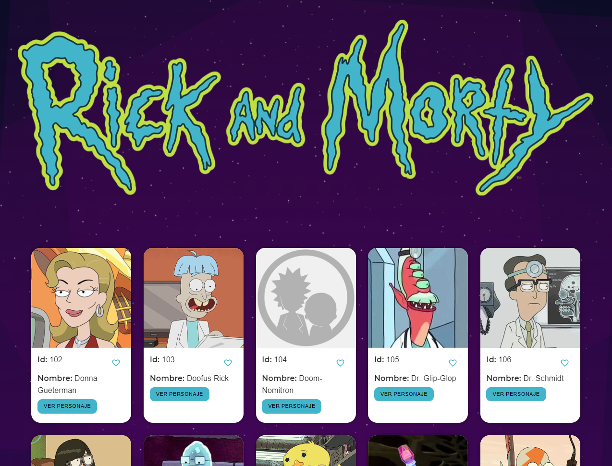

# 🌌 Rick and Morty Character Search

## 📖 Descripción


Este proyecto es una página web que permite a los usuarios buscar y listar personajes de la aclamada serie "Rick y Morty". 🚀 Utiliza la API pública de Rick y Morty para recuperar información detallada sobre los personajes, como su nombre, imagen, estado, especie, y más. Los usuarios pueden explorar todos los personajes disponibles.

## 🛠 Tecnologías Utilizadas

Este proyecto está construido con las siguientes tecnologías:

- Next.js 🟣 (v14.1.0)
- React ⚛️ (v18)
- @tanstack/react-query 🔄 (v5.22.2)
- Material-UI 🎨 (@mui/material v5.15.10 para componentes de UI)
- Tailwind CSS 🌬️ (para estilos)
- Jest 🧪 (para pruebas unitarias)
- TypeScript 📘 (para tipado estático)

## 🚀 Instalación

Para ejecutar este proyecto localmente, asegúrate de tener [Node.js](https://nodejs.org/en/) instalado.

1. Clona el repositorio:

   ```bash
   git clone https://github.com/tu-usuario/rick-and-morty-search.git
   cd rick-and-morty-search

2. Instala las dependencias:

   ```bash
   npm install
   # o
   yarn
   ```

3. Inicia el proyecto en modo desarrollo:

   ```bash
   npm run dev
   # o
   yarn dev
   ```

   Navega a http://localhost:3000 para ver la aplicación en acción. 🌟

## 📚 Uso

La página principal muestra una lista interactiva de personajes de "Rick y Morty". Haz clic en un personaje para descubrir más detalles sobre él.


## 🧪 Pruebas

Para ejecutar las pruebas unitarias:
    
    ```bash
    npm run test
    # o
    yarn test
    ```
Para un modo interactivo de pruebas:
    
    ```bash
    npm run test:watch
    # o
    yarn test:watch
    ```

Este proyecto no está afiliado, asociado, autorizado, endosado por, o de cualquier manera oficialmente conectado con la serie de televisión "Rick y Morty", o cualquiera de sus subsidiarias o afiliadas. Los personajes y otros aspectos de la serie son marcas registradas de sus respectivos dueños.

